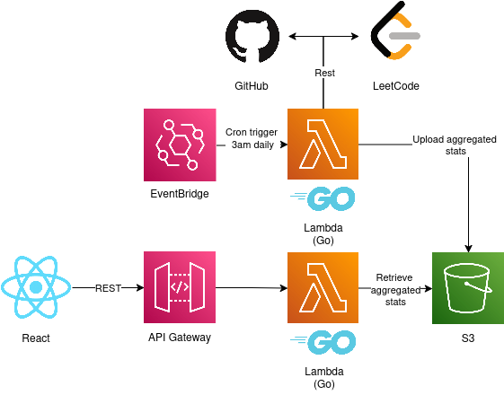

# Personal Portfolio — Frontend (React + TypeScript)

This repository contains the **frontend** for my personal developer portfolio website.  
It’s a single-page application (SPA) built with **React + TypeScript**, displaying my profile, projects, GitHub stats, and LeetCode progress.

**Live Site:** [https://limyunle.github.io/portfolio-frontend/](https://limyunle.github.io/portfolio-frontend/)  
**Backend Repo:** [Portfolio Backend (Go + AWS Lambda)](https://github.com/limyunle/portfolio-backend)

---

## Features

- Personal profile and skills
- Dynamic GitHub and LeetCode stats
- Project showcase
- Data served via AWS Lambda backend
- Hosted statically on GitHub Pages

---

## Tech Stack

| Layer           | Technology                  |
| --------------- | --------------------------- |
| **Framework**   | React                       |
| **Language**    | TypeScript                  |
| **Styling**     | Material UI                 |
| **Deployment**  | GitHub Pages                |
| **Backend API** | AWS API Gateway (Go Lambda) |

---

## Architecture Overview

```text
Frontend (React + TS)
   ↓
AWS API Gateway → Lambda (Go)
   ↓
AWS S3 (aggregated stats)
```


